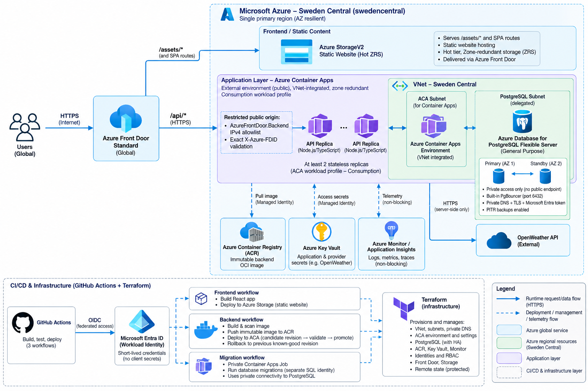

# WeatherRoeiDev — Azure Weather Platform

A cloud-native weather application created as a **DevOps home assignment**, with a focus on secure deployment, global accessibility, high availability, cost-aware architecture, and reproducible infrastructure on Microsoft Azure.

**Live website:** https://weatherroeidev-public-d4e7a2bxgxefe6cf.z03.azurefd.net/

## Solution Overview

The application provides a React-based user interface backed by a Node.js/TypeScript API. The design covers user authentication, saved location preferences, server-side calls to the OpenWeather API, and persistence in managed PostgreSQL. Azure-managed services were selected wherever practical to reduce infrastructure maintenance.

### Architecture Diagram



_Architecture diagram extracted from the submitted [architecture document](docs/submission/architecture-overview.docx)._

**Traffic flow:** A global user connects over HTTPS to **Azure Front Door Standard**. Static React assets are served from **Azure Storage static website hosting (ZRS)**, while `/api/*` traffic is sent to an Azure Container Apps backend in **Sweden Central**. The backend accesses private **Azure Database for PostgreSQL Flexible Server** and calls **OpenWeather** on the server side; secrets and observability are handled through Azure-managed services.

## Architecture Decisions — Summary of the Architecture Document

The selected architecture is the result of comparing cost, availability, privacy, performance, and operational complexity rather than choosing the cheapest individual service.

| Area             | Selected approach                                                                      | Why it was chosen                                                                                                                                                        |
| ---------------- | -------------------------------------------------------------------------------------- | ------------------------------------------------------------------------------------------------------------------------------------------------------------------------ |
| **Azure region** | **Sweden Central** (single primary region)                                             | Offers the required services and Availability Zone capabilities, with a favorable PostgreSQL HA cost among the evaluated European regions.                               |
| **Global entry** | **Azure Front Door Standard**                                                          | Provides a global HTTPS entry point, edge delivery for static content, and traffic controls without the substantially higher fixed cost of Premium.                      |
| **Frontend**     | **React / TypeScript on Azure Storage Static Website (Hot, ZRS)**                      | Lightweight static hosting without a second paid application runtime; ZRS preserves zone-level storage resilience.                                                       |
| **Backend**      | **Azure Container Apps (Consumption workload profile)**                                | Managed container hosting for a conventional Node.js API, with scaling, immutable releases and revision-based rollback. At least two replicas are part of the HA design. |
| **Data**         | **Azure Database for PostgreSQL Flexible Server (General Purpose, zone-redundant HA)** | Managed primary/standby across different Availability Zones, private database access, backups and point-in-time recovery.                                                |
| **Security**     | **VNet, private PostgreSQL, TLS, Managed Identity, Key Vault, restricted API origin**  | Keeps the database off the public internet, separates trust boundaries, and limits exposure of credentials and user data.                                                |
| **Operations**   | **Azure Monitor / Application Insights**                                               | Centralized telemetry for application health, performance and troubleshooting.                                                                                           |
| **Automation**   | **Terraform + GitHub Actions + Microsoft Entra OIDC**                                  | Separates infrastructure provisioning from building and releasing application code; avoids persistent Azure CI credentials.                                              |

**Alternatives considered:** Azure App Service was an initial preference, but the compute decision was reopened when cost-effectiveness received more scrutiny. Azure Functions Flex Consumption was also evaluated as a lower-cost candidate. **Container Apps** was selected for the balance of a conventional containerized API, operational flexibility and revision-based deployment/recovery. AKS/VM-based hosting and more expensive private-edge/multi-region designs added complexity or cost that was not justified by this workload.

## AI-Assisted Engineering — Summary of the AI Usage Document

AI was used as a **planning, development and review assistant**, not as an automatic authority for architectural decisions:

1. **Requirements and Azure learning — ChatGPT:** decomposed the assignment into functional and non-functional requirements, mapped familiar AWS concepts to Azure services, and explored cost, latency, PaaS, security, and high-availability constraints.
2. **Architecture challenge and revision — ChatGPT:** compared App Service, Container Apps, and Functions Flex; investigated the trade-off between scaling to zero and maintaining replicas for zone resilience; and revisited the initial recommendation when the total cost-benefit requirement was underweighted.
3. **Implementation guidance — GitHub Copilot in VS Code:** supported work on the application, infrastructure definitions, and deployment automation. Repository-wide and scoped `AGENTS.md` instructions, design guidance, and Architecture Decision Records (ADRs) were used to constrain and document AI-assisted changes.
4. **Infrastructure and release strategy — Terraform and GitHub Actions:** Terraform owns the Azure infrastructure and its configuration; GitHub Actions handles validation, builds, delivery and controlled releases using OIDC-based Azure authentication.
5. **Review and traceability:** prompts and model responses were retained to make the evolution of the design visible, including suggestions that were evaluated but not ultimately selected. Human-reviewed ADRs record the final decisions.

The attached [AI usage report](docs/submission/ai-usage-report.docx) includes the original ChatGPT prompt/response transcript and a short explanation of how Copilot and automation were used. Early responses in that transcript reflect **historical proposals**, not the final implementation. The project also references Copilot session documentation under `docs/ai/` in the source repository.

## Infrastructure & Delivery

```text
GitHub repository
  ├── Terraform                  -> Azure infrastructure and platform configuration
  ├── GitHub Actions (OIDC)      -> Azure authentication without long-lived CI secrets
  ├── Frontend workflow          -> build React app; publish static files to Storage
  ├── Backend workflow           -> build OCI image; push to ACR; deploy ACA revision
  └── Database migration process -> private Container Apps Job; controlled migrations
```

Terraform and CI/CD have separate ownership: Terraform defines infrastructure, identities, networking, and service configuration; deployment workflows manage application artifacts and revisions. Azure Container Registry stores backend images. Azure Key Vault holds application/provider secrets, while the backend calls OpenWeather without exposing the API key to the browser.

## Availability, Security & Cost Boundaries

- **Availability:** The design targets instance and Availability Zone failures using multiple Container Apps replicas and PostgreSQL cross-zone primary/standby. Backups and rollback complement, but do not replace, failover.
- **Privacy:** Database access is private; TLS, managed identities, access controls, secrets management, and application-level authentication help protect user information.
- **Origin protection:** Front Door **Standard** uses a restricted **public** Container Apps origin (not a private-only origin); the design combines Front Door backend source restrictions with validation of the expected `X-Azure-FDID`.
- **Global latency:** Front Door accelerates delivery and can cache approved public static content. Dynamic API requests still execute in Sweden Central; the architecture does not claim local API processing around the world.
- **Cost versus resilience:** Keeping a minimum availability baseline costs more than scale-to-zero. The single-region design intentionally avoids the expense of multi-region replication or Premium edge infrastructure.
- **Scope:** Availability Zone protection is **not** full-region disaster recovery. Actual capacity, latency and failure behavior must be established through deployment checks and testing; architecture alone is not proof of measured SLAs.

## Submission Documentation

- **[Architecture overview and selection rationale (DOCX)](docs/submission/architecture-overview.docx)** — original submission document, including the selected design, alternatives and key trade-offs.
- **[AI usage and prompt/response record (DOCX)](docs/submission/ai-usage-report.docx)** — original ChatGPT transcript and explanation of Copilot, agent instructions and deployment automation.
- **[Architecture diagram (PNG)](docs/architecture/azure_architecture.png)** — extracted directly from the architecture document and embedded above.

The detailed ADRs and any additional AI/Copilot investigation files maintained in the project repository provide the deeper decision history. This README is the high-level entry point for reviewers.
